<html>

<head>
<meta http-equiv=Content-Type content="text/html; charset=windows-1252">
<meta name=Generator content="Microsoft Word 14 (filtered)">

</head>

<body lang=EN-US link=blue vlink=purple style='text-justify-trim:punctuation'>

Template:     PollMap Application Template for
ArcGIS 10

Version:        1.0

Date:              April
28, 2011

<h1>Introduction</h1>

&nbsp;

This PollMap Application allows you to capture and map public
opinion on any issue or topic you configure. It encourages participation
through a user experience that focuses on simple things: reading the question, choosing
among the options presented, and then viewing results immediately on the map. This
gives the visitor instant feedback and an option to explore the map to see how
their vote fits within local, regional and even national contexts.

&nbsp;

This map is known simply as PollMap, or as the Esri FanMap™ when
applied to sports topics. You can see an example of this template at work in
the Esri <a href="http://fanmap.esri.com/collegehoops">FanMap™: Bracketography Edition</a>.

&nbsp;

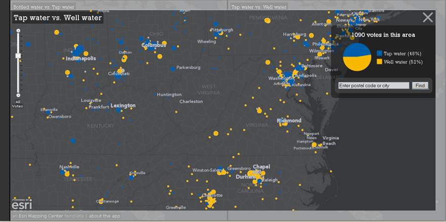

<i>Figure 1: Sample PollMap about water.</i>

<h1>What is included? </h1>

&nbsp;

This is version 1.0 of the PollMap application template. It
supports a basic type of “A vs. B” question and all documentation is written
with that in mind. 

&nbsp;

This JavaScript application is built using the ArcGIS API for
JavaScript. It contains an interactive map intended for use in a standard web
browser. It does not require browser plug-ins or installs. This application
accesses several map services and geoprocessing services.

&nbsp;

The template includes sample data to record votes by postal code
in the U.S. and Canada, and map documents (MXDs) to edit their symbology on the
map. Note: it is possible to substitute other point data to gather the votes,
e.g. see the Esri <a href="http://pollmap.esri.com/earthday">Earth Day Poll Map</a> which uses cities of
the world. That level of customization is not described in this document.

&nbsp;

The template includes two geoprocessing scripts: one to record
incoming votes and another to summarize those votes by location. 

&nbsp;

The template includes three map services: one service
(zips_winkel) to provide access to the postal codes to geoprocessing scripts,
and two services (Question01 and Question02) to symbolize the dominant vote
count at each location.

&nbsp;

The template uses a simple multi-scale basemap hosted by Esri for
use by this application. The map is in the Winkel-Tripel projection, centered
on North America. See details about this projection <a
href="http://blogs.esri.com/Support/blogs/mappingcenter/archive/2011/02/17/an-alternative-to-web-mercator-winkle-triple.aspx">here</a>. If you to deploy this
template in a site which may attract more than 100 visitors an hour, please <a
href="mailto:jherries@esri.com">contact
us</a> so
that we can work with you to arrange proper support.

<h1>Web Configuration</h1>

·&nbsp;&nbsp;&nbsp;&nbsp;&nbsp;&nbsp;&nbsp;
Microsoft
Internet Explorer 8/9, Mozilla Firefox 3.6 or higher, Google Chrome 10 or
higher

·&nbsp;&nbsp;&nbsp;&nbsp;&nbsp;&nbsp;&nbsp;
1024x768 screen
resolution recommended

<h1>Software Environment </h1>

The following software must be installed and configured: 

·&nbsp;&nbsp;&nbsp;&nbsp;&nbsp;&nbsp;&nbsp;
ArcGIS Desktop
10 with Service Pack 1

·&nbsp;&nbsp;&nbsp;&nbsp;&nbsp;&nbsp;&nbsp;
ArcGIS Server 10
with Service Pack 1 for the Microsoft .Net Framework – Standard or Advanced 

&nbsp;

Note:
This template has been optimized for ArcGIS Server the Microsoft.Net Framework.
Other configurations have not been tested.

&nbsp;

Additional software you may want to use:

·&nbsp;&nbsp;&nbsp;&nbsp;&nbsp;&nbsp;&nbsp;
Notepad,
Notepad++, DreamWeaver, IDLE (for editing .js files, .html files, .py scripts)

·&nbsp;&nbsp;&nbsp;&nbsp;&nbsp;&nbsp;&nbsp;
ColorPic (for
checking and choosing RGB color values and converting them to HEX values for
web pages)

·&nbsp;&nbsp;&nbsp;&nbsp;&nbsp;&nbsp;&nbsp;
Firefox browser
with the Firebug plug-in (to help diagnose issues with the application)

 

<b>&nbsp;</b>

<h1>Template Contents </h1>

The following files are provided in the PollMap Application
template ZIP file, which by default will unzip to 

&nbsp;

·&nbsp;&nbsp;&nbsp;&nbsp;&nbsp;&nbsp;&nbsp;
&lt;your_directory&gt;\PollMapTemplate (e.g.
D:\GIS\ArcGISTemplates\PollMapTemplate)

&nbsp;

There are three folders underneath the PollMapTemplate directory. Significant
items are listed below.

&nbsp;

<table class=MsoTableGrid border=1 cellspacing=0 cellpadding=0
 style='border-collapse:collapse;border:none'>
 <tr>
  <td width=199 valign=top style='width:119.45pt;border:solid windowtext 1.0pt;
  padding:0in 5.4pt 0in 5.4pt'>
  
<b>Template Directory</b>

  </td>
  <td width=210 valign=top style='width:125.85pt;border:solid windowtext 1.0pt;
  border-left:none;padding:0in 5.4pt 0in 5.4pt'>
  
<b>Item</b>

  </td>
  <td width=389 valign=top style='width:233.5pt;border:solid windowtext 1.0pt;
  border-left:none;padding:0in 5.4pt 0in 5.4pt'>
  
<b>Description</b>

  </td>
 </tr>
 <tr>
  <td width=199 valign=top style='width:119.45pt;border:solid windowtext 1.0pt;
  border-top:none;padding:0in 5.4pt 0in 5.4pt'>
  
PollMapTemplate

  </td>
  <td width=210 valign=top style='width:125.85pt;border-top:none;border-left:
  none;border-bottom:solid windowtext 1.0pt;border-right:solid windowtext 1.0pt;
  padding:0in 5.4pt 0in 5.4pt'>
  
Getting Started with the PollMap Application Template.pdf

  </td>
  <td width=389 valign=top style='width:233.5pt;border-top:none;border-left:
  none;border-bottom:solid windowtext 1.0pt;border-right:solid windowtext 1.0pt;
  padding:0in 5.4pt 0in 5.4pt'>
  
A PDF document that describes how to configure template and
  changes made with each release.

  </td>
 </tr>
 <tr>
  <td width=199 rowspan=2 valign=top style='width:119.45pt;border:solid windowtext 1.0pt;
  border-top:none;padding:0in 5.4pt 0in 5.4pt'>
  
/Application

  </td>
  <td width=210 valign=top style='width:125.85pt;border-top:none;border-left:
  none;border-bottom:solid windowtext 1.0pt;border-right:solid windowtext 1.0pt;
  padding:0in 5.4pt 0in 5.4pt'>
  
/PollMap subdirectory

  </td>
  <td width=389 valign=top style='width:233.5pt;border-top:none;border-left:
  none;border-bottom:solid windowtext 1.0pt;border-right:solid windowtext 1.0pt;
  padding:0in 5.4pt 0in 5.4pt'>
  
Directory containing the application pages, javascript, style
  sheets, images. 

  </td>
 </tr>
 <tr>
  <td width=210 valign=top style='width:125.85pt;border-top:none;border-left:
  none;border-bottom:solid windowtext 1.0pt;border-right:solid windowtext 1.0pt;
  padding:0in 5.4pt 0in 5.4pt'>
  
/Tools/gp subdirectory

  </td>
  <td width=389 valign=top style='width:233.5pt;border-top:none;border-left:
  none;border-bottom:solid windowtext 1.0pt;border-right:solid windowtext 1.0pt;
  padding:0in 5.4pt 0in 5.4pt'>
  
Directory containing the geoprocessing scripts.

  </td>
 </tr>
 <tr>
  <td width=199 rowspan=4 valign=top style='width:119.45pt;border:solid windowtext 1.0pt;
  border-top:none;padding:0in 5.4pt 0in 5.4pt'>
  
/Documentation

  </td>
  <td width=210 valign=top style='width:125.85pt;border-top:none;border-left:
  none;border-bottom:solid windowtext 1.0pt;border-right:solid windowtext 1.0pt;
  padding:0in 5.4pt 0in 5.4pt'>
  
DataDictionary.html

  </td>
  <td width=389 valign=top style='width:233.5pt;border-top:none;border-left:
  none;border-bottom:solid windowtext 1.0pt;border-right:solid windowtext 1.0pt;
  padding:0in 5.4pt 0in 5.4pt'>
  
An HTML document that contains a description of the Votes.gdb
  content.

  </td>
 </tr>
 <tr>
  <td width=210 valign=top style='width:125.85pt;border-top:none;border-left:
  none;border-bottom:solid windowtext 1.0pt;border-right:solid windowtext 1.0pt;
  padding:0in 5.4pt 0in 5.4pt'>
  
Question01.html

  </td>
  <td width=389 valign=top style='width:233.5pt;border-top:none;border-left:
  none;border-bottom:solid windowtext 1.0pt;border-right:solid windowtext 1.0pt;
  padding:0in 5.4pt 0in 5.4pt'>
  
An HTML document that describes the contents of Question01.mxd

  </td>
 </tr>
 <tr>
  <td width=210 valign=top style='width:125.85pt;border-top:none;border-left:
  none;border-bottom:solid windowtext 1.0pt;border-right:solid windowtext 1.0pt;
  padding:0in 5.4pt 0in 5.4pt'>
  
Question02.html

  </td>
  <td width=389 valign=top style='width:233.5pt;border-top:none;border-left:
  none;border-bottom:solid windowtext 1.0pt;border-right:solid windowtext 1.0pt;
  padding:0in 5.4pt 0in 5.4pt'>
  
An HTML document that describes the contents of Question02.mxd

  </td>
 </tr>
 <tr>
  <td width=210 valign=top style='width:125.85pt;border-top:none;border-left:
  none;border-bottom:solid windowtext 1.0pt;border-right:solid windowtext 1.0pt;
  padding:0in 5.4pt 0in 5.4pt'>
  
Zips_Winkel.html

  
&nbsp;

  </td>
  <td width=389 valign=top style='width:233.5pt;border-top:none;border-left:
  none;border-bottom:solid windowtext 1.0pt;border-right:solid windowtext 1.0pt;
  padding:0in 5.4pt 0in 5.4pt'>
  
An HTML document that describes the contents of Zips_Winkel.mxd

  </td>
 </tr>
 <tr>
  <td width=199 rowspan=8 valign=top style='width:119.45pt;border:solid windowtext 1.0pt;
  border-top:none;padding:0in 5.4pt 0in 5.4pt'>
  
/MapsandGeodatabase

  </td>
  <td width=210 valign=top style='width:125.85pt;border-top:none;border-left:
  none;border-bottom:solid windowtext 1.0pt;border-right:solid windowtext 1.0pt;
  padding:0in 5.4pt 0in 5.4pt'>
  
Question01.mxd 

  
&nbsp;

  </td>
  <td width=389 valign=top style='width:233.5pt;border-top:none;border-left:
  none;border-bottom:solid windowtext 1.0pt;border-right:solid windowtext 1.0pt;
  padding:0in 5.4pt 0in 5.4pt'>
  
The map document used to author the Question01 map.

  </td>
 </tr>
 <tr>
  <td width=210 valign=top style='width:125.85pt;border-top:none;border-left:
  none;border-bottom:solid windowtext 1.0pt;border-right:solid windowtext 1.0pt;
  padding:0in 5.4pt 0in 5.4pt'>
  
Question01.msd

  </td>
  <td width=389 valign=top style='width:233.5pt;border-top:none;border-left:
  none;border-bottom:solid windowtext 1.0pt;border-right:solid windowtext 1.0pt;
  padding:0in 5.4pt 0in 5.4pt'>
  
The map service definition used by the Question01 map service.

  </td>
 </tr>
 <tr>
  <td width=210 valign=top style='width:125.85pt;border-top:none;border-left:
  none;border-bottom:solid windowtext 1.0pt;border-right:solid windowtext 1.0pt;
  padding:0in 5.4pt 0in 5.4pt'>
  
Question02.mxd

  </td>
  <td width=389 valign=top style='width:233.5pt;border-top:none;border-left:
  none;border-bottom:solid windowtext 1.0pt;border-right:solid windowtext 1.0pt;
  padding:0in 5.4pt 0in 5.4pt'>
  
The map document used to author the Question02 map. 

  </td>
 </tr>
 <tr>
  <td width=210 valign=top style='width:125.85pt;border-top:none;border-left:
  none;border-bottom:solid windowtext 1.0pt;border-right:solid windowtext 1.0pt;
  padding:0in 5.4pt 0in 5.4pt'>
  
Question02.msd

  </td>
  <td width=389 valign=top style='width:233.5pt;border-top:none;border-left:
  none;border-bottom:solid windowtext 1.0pt;border-right:solid windowtext 1.0pt;
  padding:0in 5.4pt 0in 5.4pt'>
  
The map service definition used by the Question02 map service

  </td>
 </tr>
 <tr>
  <td width=210 valign=top style='width:125.85pt;border-top:none;border-left:
  none;border-bottom:solid windowtext 1.0pt;border-right:solid windowtext 1.0pt;
  padding:0in 5.4pt 0in 5.4pt'>
  
Zips_Winkel.mxd

  </td>
  <td width=389 valign=top style='width:233.5pt;border-top:none;border-left:
  none;border-bottom:solid windowtext 1.0pt;border-right:solid windowtext 1.0pt;
  padding:0in 5.4pt 0in 5.4pt'>
  
Simple map service to serve postal code points to the
  geoprocessing scripts. No symbology editing needed.

  </td>
 </tr>
 <tr>
  <td width=210 valign=top style='width:125.85pt;border-top:none;border-left:
  none;border-bottom:solid windowtext 1.0pt;border-right:solid windowtext 1.0pt;
  padding:0in 5.4pt 0in 5.4pt'>
  
Zips_Winkel.msd

  </td>
  <td width=389 valign=top style='width:233.5pt;border-top:none;border-left:
  none;border-bottom:solid windowtext 1.0pt;border-right:solid windowtext 1.0pt;
  padding:0in 5.4pt 0in 5.4pt'>
  
The map service definition used to author the Zips_Winkel map
  service.

  </td>
 </tr>
 <tr>
  <td width=210 valign=top style='width:125.85pt;border-top:none;border-left:
  none;border-bottom:solid windowtext 1.0pt;border-right:solid windowtext 1.0pt;
  padding:0in 5.4pt 0in 5.4pt'>
  
Votes.gdb

  </td>
  <td width=389 valign=top style='width:233.5pt;border-top:none;border-left:
  none;border-bottom:solid windowtext 1.0pt;border-right:solid windowtext 1.0pt;
  padding:0in 5.4pt 0in 5.4pt'>
  
The Votes geodatabase contains a simple votes table to record
  each vote as it comes in, and a point layer to record the summary of votes
  for each choice in that location.

  </td>
 </tr>
 <tr>
  <td width=210 valign=top style='width:125.85pt;border-top:none;border-left:
  none;border-bottom:solid windowtext 1.0pt;border-right:solid windowtext 1.0pt;
  padding:0in 5.4pt 0in 5.4pt'>
  
Votes_samples.gdb

  </td>
  <td width=389 valign=top style='width:233.5pt;border-top:none;border-left:
  none;border-bottom:solid windowtext 1.0pt;border-right:solid windowtext 1.0pt;
  padding:0in 5.4pt 0in 5.4pt'>
  
Contains sample tables and layers for testing.

  </td>
 </tr>
</table>

<h1>How to configure and use the PollMap Template</h1>

First, you will get the sample PollMap up and running on your
machine. You will configure the PollMap template for your environment, and in
doing so, learn how to publish and serve your own poll maps using ArcGIS Server
and your organization’s data. Then, the second set of steps outlines how to
customize the PollMap to contain your questions, choices and symbology for the
maps and charts.

&nbsp;

To complete these steps, you will need experience with ArcGIS
Server and Microsoft’s Internet Information Server (IIS). If you are new to
JavaScript applications, this template will demonstrate a pattern you can use
to deploy your own JavaScript application and publish web maps using ArcGIS
Server.

<h1>Implementation Steps</h1>

Follow the six implementation steps below to publish and serve the
PollMap template in your organization.  

<h1>Step 1 – Extract the ZIP File Contents</h1>

1.&nbsp;&nbsp;&nbsp;&nbsp;&nbsp; Extract the contents of
the PollMap Application Template you downloaded from ArcGIS.com in a directory
on your computer. 

&nbsp;

·&nbsp;&nbsp;&nbsp;&nbsp;&nbsp;&nbsp;&nbsp;
&lt;your_directory&gt;\PollMapTemplate (e.g.
D:\GIS\ArcGISTemplates\PollMapTemplate)

<h1>Step 2 – Publish Map Services ( Zips_Winkel, Question01 and
Question02)</h1>

&nbsp;

1.&nbsp;&nbsp;&nbsp;&nbsp; Copy everything from the
&lt;your_directory&gt;\ArcGISTemplates\PollMapTemplate\MapsandGeodatabase
directory
to a directory location that is accessible to your ArcGISSOC Account on your
ArcGIS Server computer.  The ArcGISSOC Account will need read <a
href="http://help.arcgis.com/en/arcgisdesktop/10.0/help/index.html#//002v0000000p000000.htm">permissions</a> to this directory.

&nbsp;

Or, use Windows Explorer to grant read permissions to the
ArcGISSOC Account for the following directory: 

&nbsp;

·&nbsp;&nbsp;&nbsp;&nbsp;&nbsp;&nbsp;&nbsp;
&lt;your_directory&gt;\ArcGIS Templates\PollMapTemplate\MapsandGeodatabase

&nbsp;

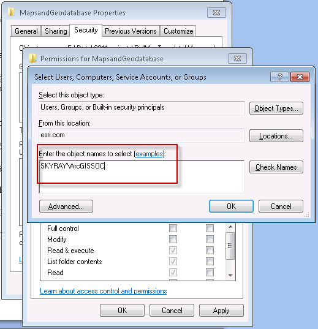

<i>Figure 2: Grant read permissions to the ArcGISSOC Account</i>

&nbsp;

2.&nbsp;&nbsp;&nbsp;&nbsp;&nbsp; Next, you will publish
the sample maps as map services. Later on, you will modify those maps, but for
now, just publish them “as is.” Using ArcCatalog, navigate to the
MapsandGeodatabase directory and publish the three dynamic map services needed
by the PollMap Application:

&nbsp;

·&nbsp;&nbsp;&nbsp;&nbsp;&nbsp;&nbsp;&nbsp;
Publish the
Zips_Winkel.msd as a map service. Use a folder if desired, and accept all other
defaults. 

·&nbsp;&nbsp;&nbsp;&nbsp;&nbsp;&nbsp;&nbsp;
Publish the
Question01.msd as a map service. Use a folder if desired, and accept all other
defaults.

·&nbsp;&nbsp;&nbsp;&nbsp;&nbsp;&nbsp;&nbsp;
Publish the
Question02.msd as a map service. Use a folder if desired, and accept all other
defaults.

&nbsp;

<i>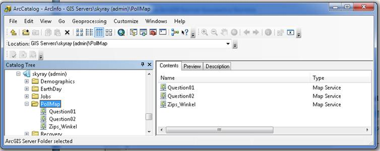</i>

<i>Figure 3: Sample services running in ArcGIS Server</i>

&nbsp;

3.&nbsp;&nbsp;&nbsp;&nbsp;&nbsp; Go to the ArcGIS
Services Directory and record the REST End Points (full URL paths) of each
service. Note: The <a
href="http://help.arcgis.com/en/webapi/javascript/arcgis/help/jshelp_start.htm">ArcGIS
Services Directory</a> is typically found at:
http://&lt;yourserver&gt;/ArcGIS/rest/services

<h1>Step 3 – Publish a Geometry Service</h1>

Using ArcCatalog, publish a <a
href="ttp://help.arcgis.com/en/arcgisserver/10.0/help/arcgis_server_dotnet_help/index.html">geometry
service</a>
to ArcGIS Server:

1.&nbsp;&nbsp;&nbsp;&nbsp;&nbsp; Right-click on the
server in ArcCatalog, and select “Add a New Service”

2.&nbsp;&nbsp;&nbsp;&nbsp;&nbsp; For type, select a
geometry service. This sets the name automatically (see Figure 4).

3.&nbsp;&nbsp;&nbsp;&nbsp;&nbsp; Accept all other
defaults. Click Finish.

&nbsp;

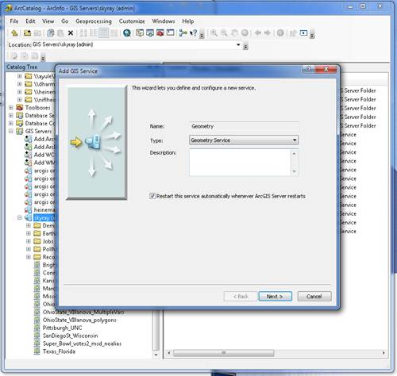

<i>Figure 4: Publish a geometry service</i>

 

<b>&nbsp;</b>

<h1>Step 4 –Configure the voting script tools</h1>

1.&nbsp;&nbsp;&nbsp;&nbsp;&nbsp; Using Windows Explorer,
navigate to the tools directory:

·&nbsp;&nbsp;&nbsp;&nbsp;&nbsp;&nbsp;&nbsp;
&lt;your_directory&gt;\ArcGIS Templates\PollMapTemplate\Application\Tools\gp

&nbsp;

2.&nbsp;&nbsp;&nbsp;&nbsp;&nbsp; Open the summarize.py
file using Notepad, Notepad++, or a python editing tool such as IDLE. One line
of code needs to be changed in this configuration. Set the path of the database
(db) to the location of your Votes.gdb (see Figure 5).

&nbsp;

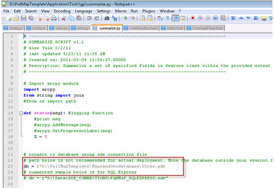

<i>Figure 5: Edit the path to the geodatabase</i>

&nbsp;

3.&nbsp;&nbsp;&nbsp;&nbsp;&nbsp; Open the votes.py file
in a python editing tool. One line of code needs to be changed in this
configuration. Set the path of the database (db) to the location of your Votes.gdb
(see Figure 6).

&nbsp;

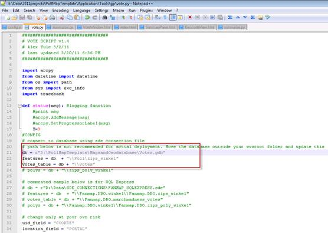

<i>Figure 6: Edit the path to the Votes geodatabase</i>

&nbsp;

&nbsp;

<h1>Step 5 –Publish the Vote Geoprocessing Services</h1>

1.&nbsp;&nbsp;&nbsp;&nbsp;&nbsp;
After editing the
scripts, copy everything from 

&lt;your_directory&gt;\ArcGISTemplates\PollMapTemplate\Tools\gp
to a directory location that
is accessible to your ArcGISSOC Account on your ArcGIS Server computer.

&nbsp;

Or, use Windows Explorer to grant the ArcGISSOC Account access to
the following directory: 

            

·&nbsp;&nbsp;&nbsp;&nbsp;&nbsp;&nbsp;&nbsp;
&lt;your_directory&gt;\ArcGIS Templates\PollMapTemplate\Tools\gp

&nbsp;

2.&nbsp;&nbsp;&nbsp;&nbsp;&nbsp; Using ArcCatalog, publish the Vote.tbx as
a <a
href="http://help.arcgis.com/en/arcgisserver/10.0/help/arcgis_server_dotnet_help/index.html">geoprocessing service</a> in ArcGIS Server.  

&nbsp;

·&nbsp;&nbsp;&nbsp;&nbsp;&nbsp;&nbsp;&nbsp;
Right-click on
your “PollMap” folder in the ArcGIS Server instance in ArcCatalog, and select
“Add a New Service.” If you are not using a folder, right-click on the server
instance instead. 

·&nbsp;&nbsp;&nbsp;&nbsp;&nbsp;&nbsp;&nbsp;
For type, select
geoprocessing service. Name the geoprocessing service “Vote” (singular). See
Figure 7. Click Next.

&nbsp;

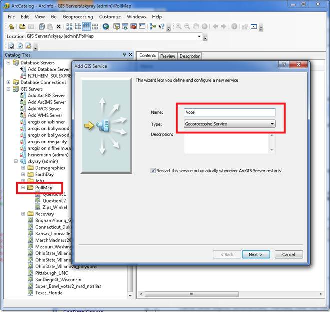

<i>Figure 7: Choose where to publish the Vote
toolbox.</i>

&nbsp;

·&nbsp;&nbsp;&nbsp;&nbsp;&nbsp;&nbsp;&nbsp;
Select execution
type as synchronous. See Figure 8.

·&nbsp;&nbsp;&nbsp;&nbsp;&nbsp;&nbsp;&nbsp;
Select “A
toolbox” and enter the location of the Vote.tbx .

·&nbsp;&nbsp;&nbsp;&nbsp;&nbsp;&nbsp;&nbsp;
Accept all other
defaults and click Next. Accept all other defaults the rest of the way. 

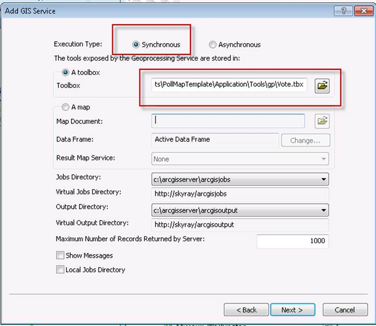

<i>Figure 8: Setting up Vote Geoprocessing Services</i>

&nbsp;

<h1>Step 6 –Publish the Application</h1>

1.&nbsp;&nbsp;&nbsp;&nbsp;&nbsp;
Copy the folder &lt;your_directory&gt;\ArcGISTemplates\PollMapTemplate\Application\PollMap
to your wwwroot directory,
typically c:/inetpub/wwwroot.

&nbsp;

2.&nbsp;&nbsp;&nbsp;&nbsp;&nbsp;
Go to your web browser
and check if the URL works, e.g. http://&lt;yourserver&gt;/PollMap. If the site works, but you don’t see any
maps, continue to the next step below. If you don’t see any application page at
all, check that IIS is running.

&nbsp;

3.&nbsp;&nbsp;&nbsp;&nbsp;&nbsp;
Go to c:\inetpub\wwwroot\PollMap\js and edit the config.js file to point to
all the services you just created in the previous five steps. Change the six
service URLs below to match the URLs you created earlier. See the next two
figures for examples.  <i>(Note: Version 1.0 of the template does not utilize
the identifyService in the config.js file).</i>

&nbsp;

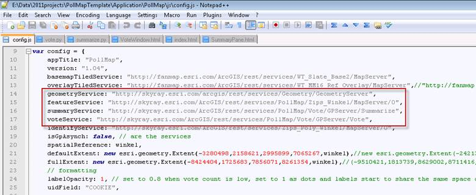

<i>Figure 9: Edit these URLs in config.js to match your actual
services. </i>

&nbsp;

&nbsp;

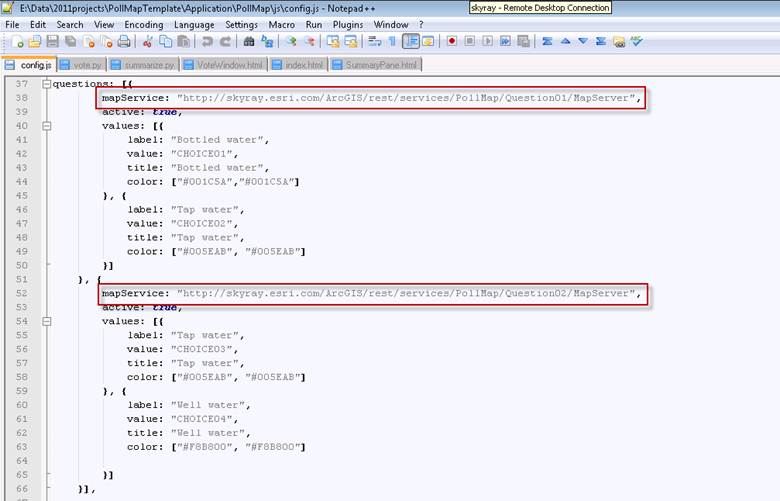

<i>Figure 10: Edit these URLs to match your actual sample services
for Question01 and Question02.</i>

&nbsp;

&nbsp;

4.&nbsp;&nbsp;&nbsp;&nbsp;&nbsp; Go to your web browser and check if the
URL works, e.g. http://&lt;yourserver&gt;/PollMap. You should see something similar to that
below, with two maps and a vote window.

&nbsp;

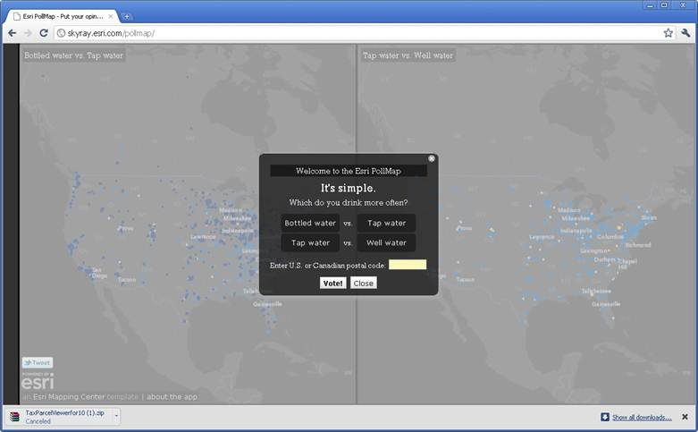

<i>Figure 11: The sample application with two working maps.</i>

&nbsp;

Test the vote dialog box to see that the vote works. If you get an
“I’m sorry” message, the first thing to do is <a
href="http://resources.esri.com/help/9.3/arcgisserver/apis/rest/index.html?admin.html">refresh your REST cache</a> on your machine. Reload
the page and try to vote again. If the “I’m sorry” message persists, the next
thing to verify is that the config.js file points to the correct geoprocessing
service URLs. Copy and paste the URLs from the config.js file to a browser to
verify that a service is running. 

&nbsp;

<h1>Customization Overview</h1>

After you’ve confirmed that the site is basically working (as in,
you can submit a vote and see a map afterwards with no error messages), then
you can start modifying the questions, choices, colors and names, map services
and data.

&nbsp;

The general sequence is:

·&nbsp;&nbsp;&nbsp;&nbsp;&nbsp;&nbsp;&nbsp;
Mock up your
question and responses up in the UI, e.g. “Which do you favor?” or “Choose one
of the following:”

·&nbsp;&nbsp;&nbsp;&nbsp;&nbsp;&nbsp;&nbsp;
Modify the
colors of the maps and pie charts to match, by choice01, choice02 etc.

·&nbsp;&nbsp;&nbsp;&nbsp;&nbsp;&nbsp;&nbsp;
Reset the votes
table and start voting to see how things are working.

&nbsp;

Steps 7-11 below are the basic customization steps to follow.

&nbsp;

<h1>Step 7 –Edit Your Questions and Responses</h1>

1.&nbsp;&nbsp;&nbsp;&nbsp;&nbsp;
Go to C:\inetpub\wwwroot\PollMap\js\esri\fanmap\templates\
directory in Windows
Explorer.

2.&nbsp;&nbsp;&nbsp;&nbsp;&nbsp;
Edit the
VoteWindow.html to tweak the title, prompt-title and subtitle (see Figure 11
below). Decisions you make here flow into subsequent edits in other files, so
it is good to get this squared away early.

&nbsp;

&nbsp;

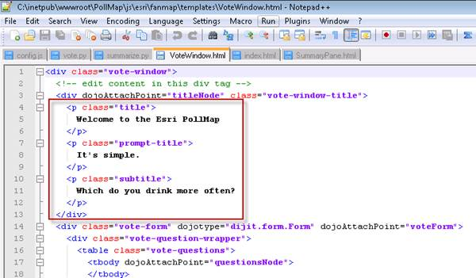

<i>Figure 12: VoteWindow.html changes.</i>

&nbsp;

3.&nbsp;&nbsp;&nbsp;&nbsp;&nbsp;
Go to c:\inetpub\wwwroot\PollMap\js and edit the config.js file to edit the
questions, their options and colors. 

4.&nbsp;&nbsp;&nbsp;&nbsp;&nbsp;
For each set of
choices, change the label to control what appears on the chart. 

5.&nbsp;&nbsp;&nbsp;&nbsp;&nbsp;
Change the title to
control what appears on the VoteWindow.html page. 

6.&nbsp;&nbsp;&nbsp;&nbsp;&nbsp;
Change the value to
the field you wish to represent that particular response in that particular
pairing of choices. In the sample below, “Tap Water” is CHOICE02 in the first
pairing, and CHOICE03 in the second pairing. 

7.&nbsp;&nbsp;&nbsp;&nbsp;&nbsp;
Set the colors. The
first value is the color of the pie slice, the second is the color of the
outline for that slice. Most of the time, using the same color for both works
best.

&nbsp;

In general, you want the colors to suit your subject, and you want
the charts’ colors to match the dots’ colors that appear on the map. ColorPic
is a great tool for checking colors onscreen and converting RGB values (used in
ArcMap) to HEX values (used in the web pages).

&nbsp;

<i>Figure 13: config.js file.</i>

&nbsp;

8.&nbsp;&nbsp;&nbsp;&nbsp;&nbsp;
Go to C:\inetpub\wwwroot\PollMap\ directory in Windows Explorer.

9.&nbsp;&nbsp;&nbsp;&nbsp;&nbsp;
Open index.html to
edit the page title, description, tags etc. to suit your situation.

&nbsp;

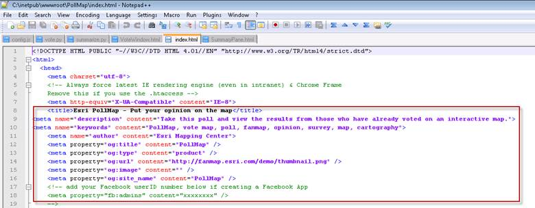

<i>Figure 14: index.html</i>

&nbsp;

&nbsp;

10.&nbsp;&nbsp; Go back to C:\inetpub\wwwroot\PollMap\js\esri\fanmap\templates\ directory in Windows Explorer.

11.&nbsp;&nbsp; Edit GeocodeView.html to tweak the text
that currently says “Enter postal code or city”, if needed. This is the FIND
box on the user interface underneath the chart.

&nbsp;

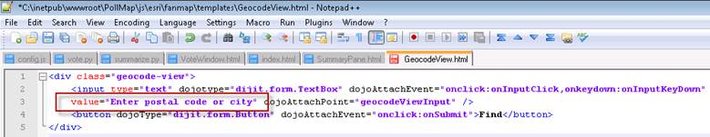

<i>Figure 15: GeocodeView.html</i>

&nbsp;

&nbsp;

12.&nbsp;&nbsp; Edit AboutWindow.html to change Facebook,
Twitter, etc. All new text needed here to suit your messaging.

&nbsp;

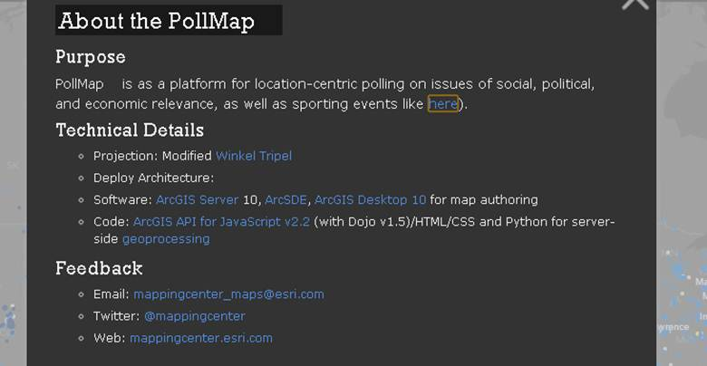

<i>Figure 16: AboutWindow.html</i>

&nbsp;

<h1>Step 8 –Examine the Data</h1>

While you are changing the questions and choices available, you
can use the sample data provided to simulate votes that have come in. If you
have completed Steps 1-5 above, those map services are already running. 

&nbsp;

After you have stopped editing everything and want to start
recording real votes in a test, you can “zero out” the votes tables and start
with a clean slate (described in a later step). For now, just have a look at
the data in ArcCatalog to get familiar with the schema and content.

&nbsp;

Votes.gdb contains:

·&nbsp;&nbsp;&nbsp;&nbsp;&nbsp;&nbsp;&nbsp;
Poll feature
data set

·&nbsp;&nbsp;&nbsp;&nbsp;&nbsp;&nbsp;&nbsp;
zips_winkel
point data

·&nbsp;&nbsp;&nbsp;&nbsp;&nbsp;&nbsp;&nbsp;
votes attribute
table, which contains the actual votes as they come in

&nbsp;

Votes_samples.gdb contains a “blank” and a “test” version of the
above.

&nbsp;

·&nbsp;&nbsp;&nbsp;&nbsp;&nbsp;&nbsp;&nbsp;
Poll feature
data set

·&nbsp;&nbsp;&nbsp;&nbsp;&nbsp;&nbsp;&nbsp;
zips_winkel_blank
point data. This is the same as the zips_winkel point data above, except that
all fields named “CHOICExx” have “0” in them. When you are ready to start
recording real votes, you can swap this layer in for the sample votes data
provided.

·&nbsp;&nbsp;&nbsp;&nbsp;&nbsp;&nbsp;&nbsp;
zips_winkel_sample
attribute table. This is the same as zips_winkel point data above, but many
records have values &gt;0 in “CHOICExx” fields so that you can experiment with
colors and symbology as needed.

·&nbsp;&nbsp;&nbsp;&nbsp;&nbsp;&nbsp;&nbsp;
votes_blank
attribute table, which is empty and ready to swap in for launch.

·&nbsp;&nbsp;&nbsp;&nbsp;&nbsp;&nbsp;&nbsp;
votes_sample attribute
table, which is populated and ready to swap in for testing.

&nbsp;

<h1>Step 9 – Edit Map Services to Match Your Questions and Responses</h1>

The Question01 map and Question02 map use graduated circles to
represent the locations. Color is set by the choice with the highest vote count
at that location. Size is set by the vote count for that choice. Follow these
steps to edit these MXDs, create fresh .MSD files, and refresh the services.

&nbsp;

1.&nbsp;&nbsp;&nbsp;&nbsp;&nbsp;
Using ArcCatalog, go
to &lt;your_directory&gt;\ArcGISTemplates\PollMapTemplate\MapsandGeodatabase

2.&nbsp;&nbsp;&nbsp;&nbsp;&nbsp;
Open Question01.mxd
and rename the data frame, group names, and each layer name as needed to match
your question and choices. 

3.&nbsp;&nbsp;&nbsp;&nbsp;&nbsp;
Modify colors of the
symbols as needed. Use ColorPic or another tool to determine the web value for
your symbol colors, so that you can update the config.js file with each
choice’s value.

4.&nbsp;&nbsp;&nbsp;&nbsp;&nbsp;
Look at the Definition
Query in each layer to see how that controls which postal codes get symbolized
in that layer. Modify as needed, e.g. if your question pairs up CHOICE05 and
CHOICE06, you want each layer to reflect that in the definition query.

5.&nbsp;&nbsp;&nbsp;&nbsp;&nbsp;
When ready to serve
your modified map, turn on the Map Service Publishing toolbar and check that
your aliasing is set to “Best/Force.”

6.&nbsp;&nbsp;&nbsp;&nbsp;&nbsp;
From the Map
Publishing toolbar, preview your map. This triggers ArcMap to correctly apply
PNG settings before you save to MSD file. Then save an .MSD file to the same
directory as the .MXD. Go refresh the services to see your changes. You may
need to refresh your cache, e.g. from http://&lt;yourserver&gt;/arcgis/rest/admin.  

.

Edit Question02.mxd in the same manner. If you rename any
services, you will also need to edit the config.js file listed earlier so that
the application knows where to obtain its maps. 

 

<b>&nbsp;</b>

<h1>Step 10 – Reset the Votes Database</h1>

Once you validate that the maps look OK using the sample data,
it’s time to “zero out” all the tables so that you can start recording votes. 

&nbsp;

1.&nbsp;&nbsp;&nbsp;&nbsp;&nbsp;
Stop all ArcGIS Server
services that use this data – be sure you’ve stopped Question01, Question02,
zips_winkel and the Vote geoprocessing service.

2.&nbsp;&nbsp;&nbsp;&nbsp;&nbsp;
In ArcCatalog, rename
the votes table and the zips_winkel data to votes_test and zips_winkel_test. If
you cannot rename the service, it is likely because some other application has
a connection open (e.g. ArcMap).

3.&nbsp;&nbsp;&nbsp;&nbsp;&nbsp;
In ArcCatalog, copy
votes_blank and zips_winkel_blank to votes and zips_winkel.

4.&nbsp;&nbsp;&nbsp;&nbsp;&nbsp;
Restart ArcGIS Server
services.

<h1>Step 11 – Additional Branding</h1>

1.&nbsp;&nbsp;&nbsp;&nbsp;&nbsp;
Go to C:\inetpub\wwwroot\PollMap\js\esri\fanmap\img
in Windows Explorer.

2.&nbsp;&nbsp;&nbsp;&nbsp;&nbsp;
Edit file 1sidebar.png
with your content, and rename it to “sidebar.png” to have the app pick up and
display it. Result appears on left side of app.

&nbsp;

 

&nbsp;

&nbsp;

&nbsp;

<table cellpadding=0 cellspacing=0 align=left>
 <tr>
  <td width=647 height=42></td>
 </tr>
 <tr>
  <td></td>
  <td></td>
 </tr>
</table>

&nbsp;

 

Template:     PollMap Application Template for
ArcGIS 10

Version:        1.0

Date:              April
28, 2011

<h1>Release Notes</h1>

The April
28, 2011 release is the first release of the PollMap Template for ArcGIS 10.

<strong>&nbsp;</strong>

<strong>New Functionality</strong>

&nbsp;

N/A

<strong>&nbsp;</strong>

<strong>Resolved Problems</strong>

&nbsp;

<strong>N/A</strong>

<strong>&nbsp;</strong>

<strong>Known Issues</strong>

&nbsp;

Internet
Explorer 7 is not currently supported. The application advises the viewer with
Internet Explorer 7 that the application is not supported in that browser.

On
vote, you are limited to the postal codes in this particular database, which
comes directly from the Esri Data &amp; Maps DVD for ArcGIS 10. There is always
the chance that someone will use a postal code they are 100% sure is real, and
it very well may be real, but just isn’t in this particular database. Most of
the time, they will try a similar postal code and continue. The “Find” tool on
the chart works with a much larger gazetteer online, so users can type in a
pretty wide variety of place names, universities, towns, postal codes, etc. 

Thanks
for using this template. Send comments about this template to <a
href="mailto:jherries@esri.com">jherries@esri.com</a> 

&nbsp;

</body>

</html>
